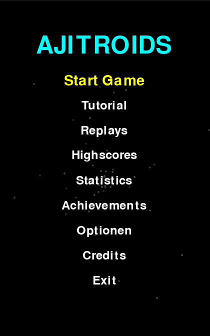
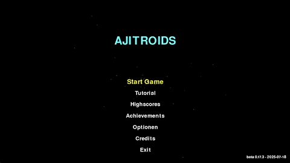

<!-- markdownlint-disable MD013 -->
# 🚀 Ajitroids


[](https://python.org)
[](https://github.com/Ajimaru/ajitroids/releases/latest)


[A modern Asteroids remake built with Pygame]



## 🎮 Game Description

Ajitroids is an exciting remake of the classic arcade game Asteroids with modern features and gameplay elements.
Pilot your spaceship through dangerous asteroid fields, dodge space rocks, destroy enemies and collect power-ups while trying to achieve the highest score.



## ✨ Features

- **Classic Gameplay**: Control your ship with precise rotation and thrust
- **Modern Graphics**: Enhanced visuals with particle effects and animations
- **Sound System**: Dynamic sound effects and background music
- **Power-Up System**: Collect various weapon upgrades and shields
- **Highscore System**: Save your best results and compare them
- **Boss Fights**: Face epic boss enemies in higher levels
- **Customizable Settings**: Fullscreen mode, sound options and more
- **Smooth Animations**: Fluid ship movements and asteroid rotations

## 🚀 Installation

### Prerequisites

- Python 3.9 or higher (tested up to 3.12)
- [uv](https://github.com/astral-sh/uv) or pip

### Installation with uv (recommended)

```bash
# Clone repository
git clone https://github.com/Ajimaru/ajitroids.git
cd ajitroids

# Install dependencies
uv sync

# Start the game
uv run main.py
```

### Installation with pip

```bash
# Clone repository
git clone https://github.com/Ajimarue/ajitroids.git
cd ajitroids

# Install dependencies
pip install -r requirements.txt

# Start the game
python main.py
```

## 🌟 Gameplay

- **Main Menu:** Choose from different game modes or adjust settings
- **Tutorial:** Learn the basics of the game (recommended for beginners)
- **Asteroids:** Destroy asteroids to collect points
- **Power-Ups:** Collect special power-ups for unique abilities
- **Boss Enemies:** Powerful boss enemies appear after certain levels
- **Highscores:** Save your best performances and compare them with others
- **Achievements:** Unlock achievements for completing special challenges

## 🎯 Controls

### Game Controls
- **Arrow Keys**: Control ship (rotation and thrust)
- **Space**: Shoot
- **ESC**: Pause game
- **B**: Switch weapons (when available)

### Function Keys
- **F1 / H**: Toggle help screen (in-game)
- **F8**: Toggle FPS display
- **F9**: Toggle sound effects
- **F10**: Toggle music
- **F11**: Toggle fullscreen

## 💻 Command-Line Options

Ajitroids supports several command-line arguments for enhanced control:

```bash
# Display version
python main.py --version

# Show help and available options
python main.py --help

# Enable debug mode with verbose logging
python main.py --debug

# Skip main menu and start game directly
python main.py --skip-intro

# Force windowed or fullscreen mode
python main.py --windowed
python main.py --fullscreen

# Save logs to a file
python main.py --log-file game.log
```

## 🚀 Spaceships

Ajitroids features unlockable spaceships with unique abilities:

- **Speedster**: A fast and agile ship, perfect for dodging asteroids.
- **Tank**: A heavily armored ship that can fire on two directions.
- **Destroyer**: A powerful ship equipped with advanced weaponry.

Unlock these ships by progressing through the game and achieving milestones!

## 🛡️ Enemies

- **Enemy Ships**: Hostile ships that chase the player and add challenge to the gameplay
- **Interaction**: Enemies can collide with the player and be destroyed by weapons
- **Dynamic Movement**: Enemies actively pursue the player within a detection radius

## 🛠️ Technical Details

- Developed with Pygame
- Object-oriented design with separate classes for game elements
- Modular sound engine with dynamic effects
- Efficient particle system for visual effects
- Collision detection with optimized algorithms

## 📚 Documentation

Comprehensive developer documentation is available:

- **[Developer Documentation](https://ajimaru.github.io/ajitroids/)**: Complete guide for developers
- **[Getting Started](https://ajimaru.github.io/ajitroids/getting-started/)**: Setup and installation
- **[Architecture](https://ajimaru.github.io/ajitroids/architecture/overview/)**: Code architecture and design
- **[API Reference](https://ajimaru.github.io/ajitroids/api/python/)**: Auto-generated API docs
- **[Contributing Guide](https://ajimaru.github.io/ajitroids/development/contributing/)**: How to contribute

### Building Documentation Locally

```bash
# Install documentation dependencies
pip install -r requirements-docs.txt

# Serve documentation locally
mkdocs serve

# Open http://127.0.0.1:8000 in your browser
```

## 📜 License

This project is licensed under the MIT License with Commons Clause - see the LICENSE.md file for details.

### 👥 Contributors

- Me - Main Developer
- GitHub Copilot - Development Assistant

### 🙏 Acknowledgements

- Inspiration from the classic Atari game Asteroids
- Thanks to the [Pygame](https://www.pygame.org/ "Pygame Homepage") community for the great library
- [Boot.dev](https://www.boot.dev/ "Boot.dev Homepage") for support and inspiration
- GitHub Copilot for assistance with code development
- Developed with ❤️ and Pygame

*Note: This project is in active development. New features and improvements are regularly being added.*
