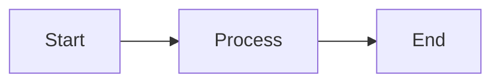

# Ajitroids Documentation

This directory contains the source files for the Ajitroids developer documentation, built with [MkDocs](https://www.mkdocs.org/) and [Material for MkDocs](https://squidfunk.github.io/mkdocs-material/).

## Quick Start

### Prerequisites

```bash
pip install -r requirements-docs.txt
```

### Build & Serve Locally

```bash
# Serve with live reload (default: http://127.0.0.1:8000)
mkdocs serve

# Build static site
mkdocs build
```

The built site will be in the `site/` directory.

## Documentation Structure

```
docs/
├── index.md                          # Home page
├── getting-started.md                # Setup and installation guide
├── architecture/                     # Architecture documentation
│   ├── overview.md                   # High-level architecture
│   ├── data-flow.md                  # Data flow diagrams
│   ├── game-mechanics.md             # Game mechanics and algorithms
│   ├── settings.md                   # Settings system
│   └── pygame-integration.md         # Pygame usage
├── api/                              # API documentation
│   └── python.md                     # Python API (auto-generated)
├── development/                      # Development guides
│   ├── contributing.md               # Contribution guidelines
│   ├── testing.md                    # Testing guide
│   └── release-process.md            # Release workflow
└── reference/                        # Reference documentation
    ├── configuration.md              # Configuration reference
    ├── cli-dev-scripts.md            # Development scripts
    └── diagrams/                     # UML diagrams
        └── .gitkeep
```

## Writing Documentation

### Markdown Files

All documentation is written in Markdown with some extensions:

- **Admonitions**: Info boxes, warnings, tips
- **Code highlighting**: Syntax highlighting for code blocks
- **Mermaid diagrams**: Inline diagram support
- **Table of contents**: Auto-generated from headers

### Example Admonition

```markdown
!!! note "Important Note"
    This is a note admonition.

!!! warning
    This is a warning.

!!! tip
    This is a tip.
```

### Example Mermaid Diagram

````markdown

````

### Code Blocks

````markdown
```python
def example():
    return "Hello, World!"
```
````

## Auto-Generated API Documentation

The Python API documentation is auto-generated using [mkdocstrings](https://mkdocstrings.github.io/).

### How It Works

In `docs/api/python.md`:

````markdown
::: modul
    handler: python
    options:
      members_order: source
      show_source: true
````

This automatically generates documentation from Python docstrings in the `modul/` directory.

### Docstring Format

Use Google-style docstrings:

```python
def example_function(param1: int, param2: str) -> bool:
    """Brief description of function.
    
    Longer description if needed.
    
    Args:
        param1: Description of param1
        param2: Description of param2
        
    Returns:
        Description of return value
        
    Raises:
        ValueError: When something goes wrong
    """
    return True
```

## UML Diagrams

Generate UML diagrams with:

```bash
./scripts/generate-diagrams.sh
```

This creates class and package diagrams in `docs/reference/diagrams/`.

### Prerequisites

```bash
pip install pylint graphviz

# On Ubuntu/Debian
sudo apt-get install graphviz

# On macOS
brew install graphviz
```

## GitHub Pages Deployment

Documentation is automatically deployed to GitHub Pages when changes are pushed to the `main` branch.

### Workflow

See `.github/workflows/docs.yml` for the automated deployment workflow.

### Manual Deployment

```bash
mkdocs gh-deploy
```

## Configuration

### mkdocs.yml

The main configuration file. Key sections:

- **site_name**: Site title
- **theme**: Material theme configuration
- **markdown_extensions**: Enabled markdown features
- **plugins**: MkDocs plugins (search, mkdocstrings)
- **nav**: Navigation structure

### requirements-docs.txt

Python dependencies for building documentation:

- `mkdocs`: Core documentation framework
- `mkdocs-material`: Material theme
- `mkdocstrings`: API documentation generator
- `mkdocstrings-python`: Python handler for mkdocstrings
- `pymdown-extensions`: Additional markdown extensions

## Tips for Contributors

### Adding a New Page

1. Create a new `.md` file in the appropriate directory
2. Add it to the `nav` section in `mkdocs.yml`
3. Build and test locally: `mkdocs serve`

### Linking Between Pages

Use relative links:

```markdown
See [Getting Started](../getting-started.md) for details.
```

### Images

Place images in `docs/assets/` and reference them:

```markdown

```

### Internal Links

Link to specific sections:

```markdown
See [Architecture Overview](architecture/overview.md#high-level-architecture)
```

## Troubleshooting

### Build Errors

If you get build errors:

1. Check that all links are valid
2. Ensure all referenced files exist
3. Run `mkdocs build --strict` for detailed errors

### Missing Dependencies

```bash
pip install --upgrade -r requirements-docs.txt
```

### Port Already in Use

```bash
mkdocs serve --dev-addr localhost:8001
```

## Resources

- [MkDocs Documentation](https://www.mkdocs.org/)
- [Material for MkDocs](https://squidfunk.github.io/mkdocs-material/)
- [mkdocstrings Documentation](https://mkdocstrings.github.io/)
- [Markdown Guide](https://www.markdownguide.org/)

## License

Documentation is part of the Ajitroids project and follows the same MIT license.
