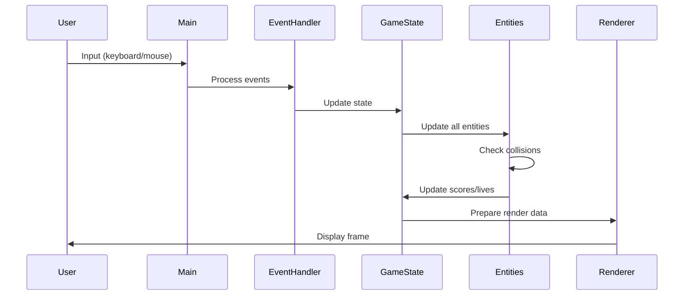
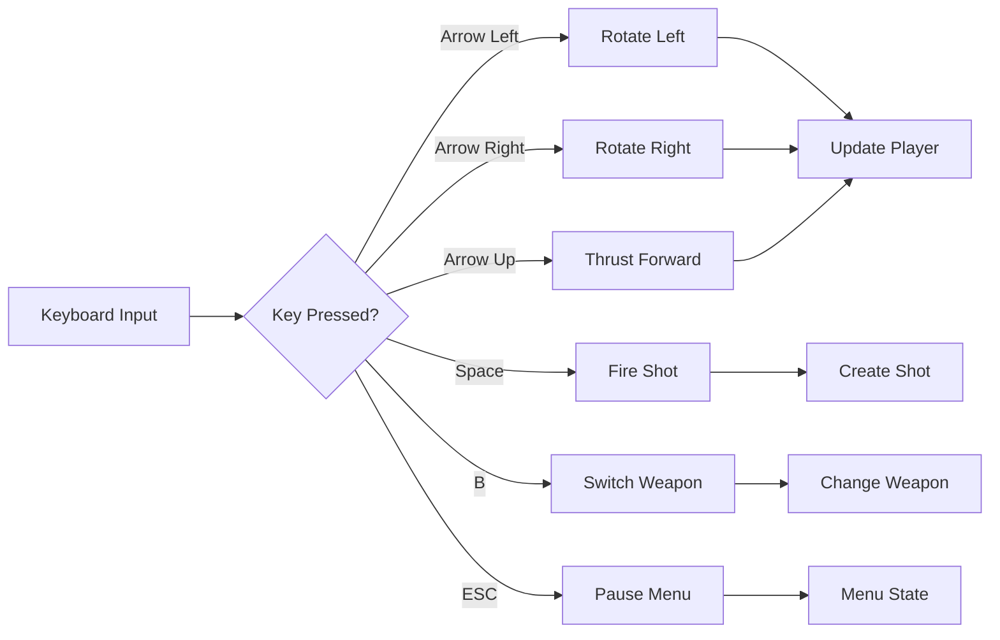
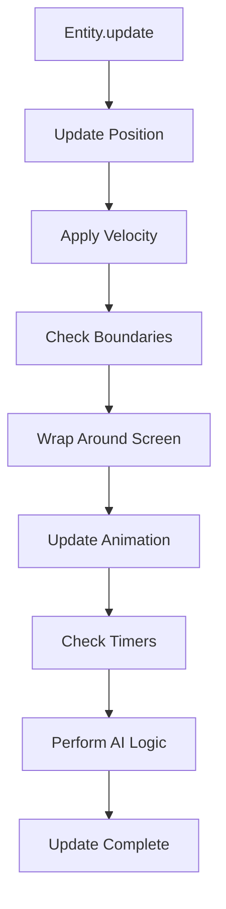
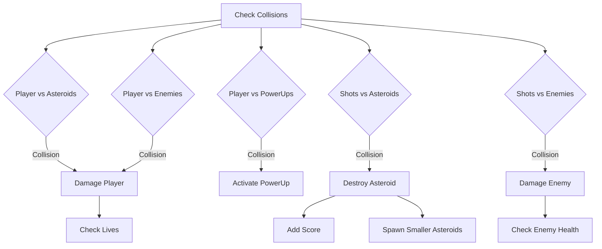
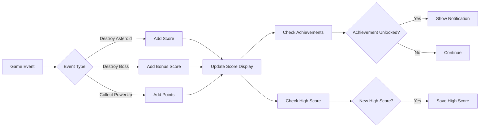
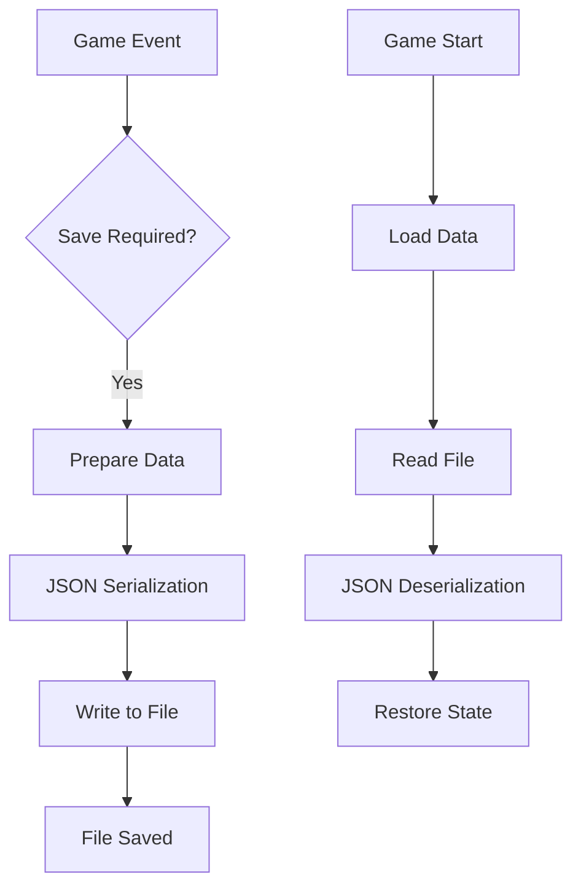
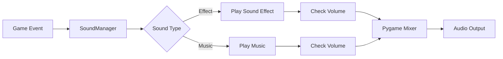
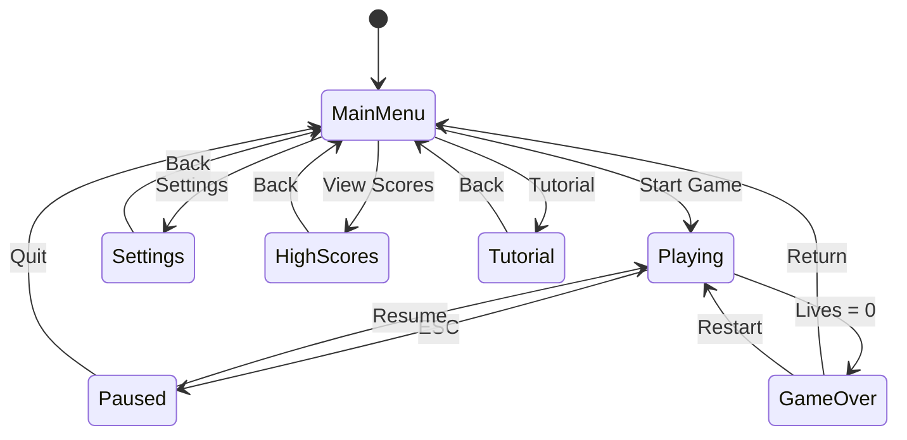
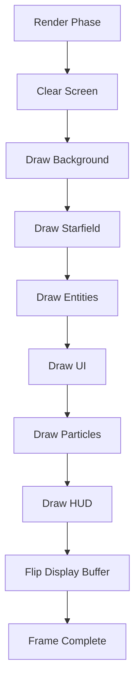

# Data Flow

This document describes how data flows through the Ajitroids game, from user
input to screen rendering.

## Game Loop Data Flow



## Main Game Loop

The main loop in `main.py` coordinates all game systems:

```python
while running:
    # 1. Handle Events
    for event in pygame.event.get():
        if event.type == pygame.QUIT:
            running = False

    # 2. Get Input State
    keys = pygame.key.get_pressed()

    # 3. Update Phase
    for obj in updatable:
        obj.update(dt)

    # 4. Collision Detection
    check_collisions()

    # 5. Render Phase
    screen.fill(BLACK)
    for obj in drawable:
        obj.draw(screen)
    pygame.display.flip()

    # 6. Frame Rate Control
    dt = clock.tick(60) / 1000
```

## Player Input Flow



### Input Processing

1. **Event Queue**: Pygame events are polled each frame
2. **Key State**: Current keyboard state is checked
3. **Player Update**: Player responds to input
4. **Action Execution**: Actions are performed (shooting, moving, etc.)

## Entity Update Flow

Each game entity updates independently but follows a common pattern:

### Update Cycle



### Example: Asteroid Update

```python
def update(self, dt):
    # 1. Move based on velocity
    self.position += self.velocity * dt

    # 2. Rotate
    self.rotation += self.rotation_speed * dt

    # 3. Wrap around screen
    if self.position.x < 0:
        self.position.x = SCREEN_WIDTH

    # 4. Update sprite
    self.rect.center = self.position
```

## Collision Detection Flow



### Collision Detection Algorithm

Ajitroids uses circular collision detection:

```python
def collides_with(self, other):
    distance = self.position.distance_to(other.position)
    return distance < self.radius + other.radius
```

## Score and Achievement Flow



### Achievement Triggers

The `AchievementManager` monitors various game events:

- Score milestones
- Asteroid destruction counts
- Boss defeats
- Specific action combinations
- Time-based achievements

## State Persistence Flow



### Persistent Data

The following data is saved between sessions:

- **High Scores**: Top 10 scores with names
- **Achievements**: Unlocked achievements list
- **Settings**: Audio, video, and control preferences
- **Unlocked Ships**: Available ship types

Files are stored as JSON in the user's home directory.

## Sound System Flow



### Sound Event Triggers

- **Player Actions**: Shooting, thrust
- **Collisions**: Asteroid hits, explosions
- **Power-ups**: Collection sounds
- **Menu**: UI interaction sounds
- **Music**: Background tracks for different game states

## Menu State Flow



### State Transitions

Menu states are managed by the `Menu` class, which handles:

- Rendering the appropriate UI
- Processing user input
- Transitioning between states
- Maintaining state data (scores, settings, etc.)

## Render Pipeline



### Rendering Order

1. **Background**: Fill with black
2. **Starfield**: Parallax star background
3. **Entities**: All game objects (back-to-front)
4. **Effects**: Particle systems
5. **UI**: Menu elements, HUD
6. **Overlays**: Achievements, notifications

## Performance Optimization

### Sprite Group Updates

Pygame's sprite groups batch operations:

```python
# Efficient: Update all at once
updatable.update(dt)

# Efficient: Draw all at once
drawable.draw(screen)
```

### Collision Optimization

Only check relevant collision pairs:

- Player vs asteroids/enemies/powerups
- Shots vs asteroids/enemies
- Enemies vs asteroids (optional)

### Event Batching

Process multiple similar events together to reduce overhead.

## Next Steps

- [Game Mechanics](game-mechanics.md): Understand the gameplay algorithms
- [Settings](settings.md): Configuration and customization
- [Pygame Integration](pygame-integration.md): How Pygame is used
