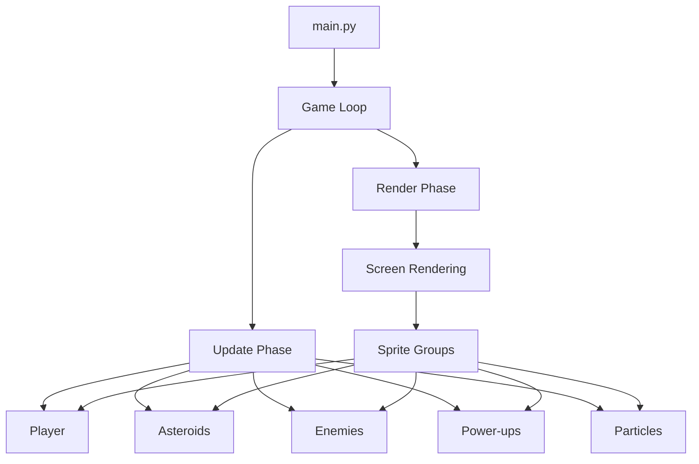
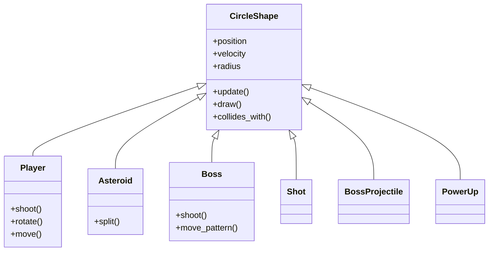

# Architecture Overview

Ajitroids is built with a clean, object-oriented architecture that separates concerns and makes the codebase easy to understand and extend.

## High-Level Architecture

## Core Components

### 1. Game Loop (`main.py`)

The main game loop follows the standard game development pattern:

1. **Handle Input**: Process keyboard/mouse events
2. **Update**: Update game state for all entities
3. **Render**: Draw all entities to the screen
4. **Control Frame Rate**: Maintain consistent FPS

### 2. Entity System

All game entities inherit from base classes:

- **`CircleShape`**: Base class for circular entities with collision detection
- **`Player`**: Player-controlled spaceship
- **`Asteroid`**: Destructible asteroids
- **`Boss`**: Enemy boss characters
- **`Shot`**: Player projectiles
- **`BossProjectile`**: Enemy projectiles
- **`PowerUp`**: Collectible power-ups
- **`Particle`**: Visual effects

### 3. Manager Systems

Several manager classes handle cross-cutting concerns:

- **`SoundManager`**: Manages all game audio
- **`HighscoreManager`**: Persists and displays high scores
- **`AchievementManager`**: Tracks and unlocks achievements
- **`Menu`**: Handles UI and menu navigation
- **`Settings`**: Manages game configuration

### 4. Sprite Groups (`groups.py`)

Pygame sprite groups organize entities for efficient updating and rendering:

- `updatable`: All entities that need per-frame updates
- `drawable`: All entities that need to be rendered
- `asteroids`: All asteroid entities
- `shots`: All projectile entities
- `enemies`: All enemy entities
- `powerups`: All power-up entities

## Design Patterns

### Inheritance Hierarchy

### Observer Pattern

The achievement system uses an observer pattern:

- Game events trigger achievement checks
- `AchievementManager` listens for specific conditions
- Notifications display when achievements are unlocked

### State Pattern

The menu system implements a state machine:

- Different menu states (main menu, settings, game, pause, etc.)
- State transitions based on user input
- Each state has its own update and render logic

## Module Organization

### Core Game Modules

- **`circleshape.py`**: Base class for circular collision detection
- **`player.py`**: Player ship mechanics and controls
- **`asteroid.py`**: Asteroid behavior and splitting logic
- **`boss.py`**: Boss enemy AI and attack patterns
- **`shot.py`**: Projectile physics and lifecycle
- **`powerup.py`**: Power-up types and effects

### System Modules

- **`sounds.py`**: Audio management and sound effects
- **`menu.py`**: UI rendering and menu navigation
- **`highscore.py`**: Score persistence and display
- **`achievements.py`**: Achievement tracking and unlocking
- **`settings.py`**: Configuration management

### Support Modules

- **`constants.py`**: Game constants and configuration values
- **`groups.py`**: Sprite group definitions
- **`starfield.py`**: Background star rendering
- **`asteroidfield.py`**: Asteroid spawning logic
- **`particle.py`**: Particle effect system
- **`tutorial.py`**: Tutorial mode implementation
- **`ships.py`**: Ship definitions and unlockables

## Data Flow

See [Data Flow](data-flow.md) for detailed information about how data moves through the system.

## Game State Management

The game maintains several state variables:

- **Game phase**: Menu, playing, paused, game over
- **Player state**: Lives, score, power-ups, current ship
- **World state**: Active asteroids, enemies, projectiles
- **Persistent state**: High scores, achievements, settings

## Performance Considerations

### Sprite Groups

Pygame's sprite groups provide efficient collision detection and batch rendering.

### Object Pooling

Particles and some projectiles may be pooled to reduce garbage collection overhead.

### Spatial Partitioning

Collision detection is optimized by checking only nearby entities.

## Extension Points

The architecture makes it easy to extend the game:

1. **New Enemies**: Inherit from `CircleShape` or `Boss`
2. **New Power-ups**: Add to `powerup.py` with new effect types
3. **New Ships**: Define in `ships.py` with unique attributes
4. **New Achievements**: Add conditions to `achievements.py`

## Next Steps

- [Data Flow](data-flow.md): Understand data movement in the game
- [Game Mechanics](game-mechanics.md): Learn about algorithms and gameplay
- [Pygame Integration](pygame-integration.md): How we use Pygame
