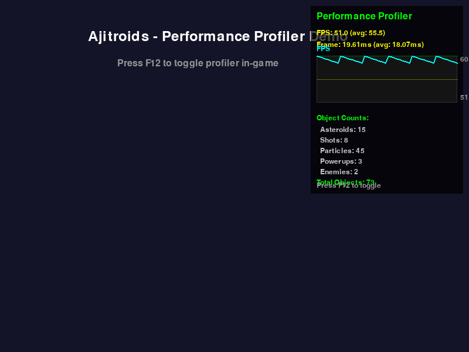

# Performance Profiler

The Performance Profiler provides real-time monitoring of game performance
metrics during gameplay.

## Overview

The Performance Profiler is an in-game overlay that displays key performance
metrics including FPS (Frames Per Second), frame time, and object counts. It
helps developers and players monitor the game's performance in real-time.



_The performance profiler overlay showing FPS graph, frame time, and object
counts_

## Usage

### Keyboard Shortcut

Press **F12** during gameplay to toggle the performance profiler on or off.

### What it Shows

The profiler displays the following information:

1. **FPS Metrics**
   - Current FPS
   - Average FPS over the last 2 seconds
   - Color-coded based on performance:
     - Green: ≥55 FPS (Good)
     - Yellow: 30-54 FPS (Moderate)
     - Red: <30 FPS (Poor)

2. **Frame Time**
   - Current frame time in milliseconds
   - Average frame time over the last 2 seconds

3. **FPS Graph**
   - Visual graph showing FPS history
   - Reference lines at 60 FPS (green) and 30 FPS (yellow)
   - Max and min values displayed

4. **Object Counts**
   - Asteroids
   - Shots
   - Particles
   - Powerups
   - Enemies
   - Total objects in the scene

## Implementation Details

### Module: `modul/performance_profiler.py`

The profiler is implemented as a standalone module that can be easily integrated
into any pygame-based game.

### Key Features

- **Non-intrusive**: Minimal performance impact
- **Real-time updates**: Updates every frame when enabled
- **Historical data**: Keeps last 120 samples (2 seconds at 60 FPS)
- **Visual graphs**: Easy-to-read performance graphs
- **Color coding**: Quick visual feedback on performance status

### API

```python
from modul.performance_profiler import PerformanceProfiler

# Initialize
profiler = PerformanceProfiler(max_samples=120)

# Toggle on/off
profiler.toggle()

# Update (call every frame)
object_groups = {
    'asteroids': asteroids_group,
    'shots': shots_group,
    'particles': particles_group,
    'powerups': powerups_group,
    'enemies': enemies_list
}
profiler.update(dt, clock, object_groups)

# Draw (call after all game rendering)
profiler.draw(screen)

# Get summary statistics
summary = profiler.get_summary()
# Returns: {
#     'avg_fps': float,
#     'min_fps': float,
#     'max_fps': float,
#     'avg_frame_time_ms': float,
#     'max_frame_time_ms': float,
#     'total_objects': int
# }
```

### Integration Points

The profiler is integrated into the main game loop in `main.py`:

1. **Initialization** (line ~241):

   ```python
   performance_profiler = PerformanceProfiler()
   ```

2. **Toggle Handler** (line ~302):

   ```python
   elif event.key == pygame.K_F12:
       profiler_enabled = performance_profiler.toggle()
   ```

3. **Update** (line ~618):

   ```python
   performance_profiler.update(dt, clock, object_groups)
   ```

4. **Draw** (line ~1016):
   ```python
   performance_profiler.draw(screen)
   ```

## Performance Considerations

The profiler itself has minimal performance impact:

- Only updates when enabled
- Uses efficient deque data structure for history
- Simple drawing operations with minimal overhead
- No file I/O or heavy computations

## Testing

The profiler includes comprehensive unit tests in
`tests/test_performance_profiler.py`:

```bash
# Run profiler tests
pytest tests/test_performance_profiler.py -v

# Run with coverage
pytest tests/test_performance_profiler.py --cov=modul.performance_profiler
```

## Tips for Developers

1. **Performance Bottlenecks**: Use the profiler to identify when FPS drops
   occur and correlate with object counts.

2. **Optimization**: Watch the object counts to see if particle systems or other
   dynamic objects are growing unexpectedly.

3. **Testing**: Enable the profiler during development to catch performance
   regressions early.

4. **Target FPS**: The game targets 60 FPS. Consistent frame times around
   16.67ms indicate smooth performance.

## Future Enhancements

Potential improvements to consider:

- Memory usage tracking (requires psutil)
- Network latency monitoring (for multiplayer)
- Draw call counting
- Custom performance markers
- Performance logging to file
- Configurable graph colors and sizes
